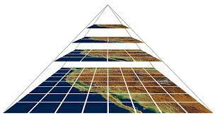

.. vector_tiles documentation master file, created by
   sphinx-quickstart on Thu Dec 23 15:01:14 2021.
   You can adapt this file completely to your liking, but it should at least
   contain the root `toctree` directive.

********************************************
Cartografia base en projectes de webmapping
********************************************

La cartografia base
=====================

En la major part d'aplicacions de *webmapping*, utilitzem cartografia base per a contextualitzar les dades que volem representar.
La font d'aquestes dades pot ser molt divers, i malgrat que ens podem arribar a generar nosaltres mateixos aquestes dades, el mes normal és estirar de diferents proveïdors.

Alguns dels proveïdors mes habituals, son:

- OpenStreetMap (https://www.openstreetmap.org)
- Google Maps
- Mapbox (https://www.mapbox.com/maps)
- OpenMapTiles (https://openmaptiles.org/)
- ICGC (https://openicgc.github.io/)
- Stamen (http://maps.stamen.com/#toner/12/37.7706/-122.3782)
- etc

Alguns d'aquests serveis, no obstant, son de pagament, o s'ofereixen de forma gratuïta amb un límit de peticions.
Caldrà tenir-ho en consideració, i en funció de les visites que preveiem que la nostra aplicació pot arribar a tenir, s'hauran de contractar els paquets de serveis corresponents.

Així mateix, podem optar per un servei o un altre en funció dels estils predefinits que ofereixen, i que poden encaixar amb el disseny de la nostra aplicació:
Alguns exemples:

Midimapping: https://sigserver4.udg.edu/apps/midimapping

Mosquito Alert: http://www.mosquitoalert.com/ca/

.. note::
   Generar la nostra pròpia cartografia base per a una aplicació *webmapping*, implica

   a) disposar de la cartografia de referència
   b) aplicar-hi els estils corresponents
   c) allotjar les dades
   d) servir-les de forma òptima

Vector Tiles vs Raster Tiles
=============================

Actualment (i deixant de banda els serveis WMS), trobem dos formes de generar la cartografia base: en Vector Tiles i en Raster Tiles.

En les teseles raster, el mapa no s'emmagatzema en una única imatge. Es **pregeneren** petites imatges rectangulars del mateix tamany (teseles) per a cada nivell de zoom, que es combinen per a formar mapes mes grans.
D'aquesta manera, només es serveix a l'usuari una petita fracció d'un gran conjunt de dades, fet que garanteix una major velocitat en l'entrega de les dades en un entorn web.

Per altra banda, en les teseles vectorials, els estils es renderitzen en el navegador del client (no estàn pregenerades). Ofereixen una capacitat de zoom infinita, i com que les dades vectorials es troben disponibles en el client, es poden representar mapes de molt alta resolució.
El client té accés a la informació dels objectes geogràfics (atributs i geometria), ja que no es tracta d'imatges, sinó d'entitats vectorials.

Iniciant un projecte de webmapping
===================================

En aquesta ocasió treballarem amb la llibrería OpenLayers: https://openlayers.org

.. note::
   Tant Leaflet com OpenLayers permeten carregar Vector Tiles i Raster Tiles. Leaflet, no obstant, ara per ara no incorpora la capacitat d'interpretar els estils generats amb l'especificació de Mapbox **Vector Tile GL**, i s'han de crear segons l'especificació de la llibreria, fet que no permet integrar l'estil generat per ContextMaps (de l'ICGC) o Mapbox.

Per a desenvolupar un projecte d'OpenLayers, és aconsellable utilitzar OpenLayers + **Node.js**

El fet de treballar amb Node, ofereix avantatges com:

1. Permet utilitzar mòduls, en comptes de carregar tota la llibrería.
2. Proporciona un servidor local de desenvolupament
3. És la forma en que es mostren els exemples de la pàgina web d'OpenLayers.

Per a iniciar un projecte d'OpenLayers amb Node, seguim les següents instruccions:

.. code-block:: console

  mkdir mapa
  cd mapa
  npx create-ol-app
  npm start

Ens crearà automàticament l'aplicació, separant ja els fitxers html, js i css.
Podrem veure el mapa accedint a la url del servidor de desenvolupament que s'haurà iniciat.

Donat que probablement no tenim permisos per a instalar node, podem també crear un mapa d'exemple en un document *html*. Creeu un fitxer **index.html**, i afegiu el següent codi:

.. code-block:: html

  <!doctype html>
  <html lang="en">
    <head>
      <meta charset="utf-8">
      <link rel="stylesheet" href="https://cdn.jsdelivr.net/gh/openlayers/openlayers.github.io@master/en/v6.9.0/css/ol.css" type="text/css">
      
      
      <title>OpenLayers example</title>
    </head>
    <body>
      <h2>My Map</h2>
      

      
    </body>
  </html>

En aquesta ocasió, estem carregant com a mapa base una capa d'OpenStreetMap.

Afegim capes al mapa
=====================

A OpenLayers, podrem afegir una capa al mapa (exemple, un marcador) i aplicar-hi un estil, de la següent manera:

.. code-block:: javascript

    var markerStyle = new ol.style.Style({
      image: new ol.style.Circle({
        radius: 7,
        fill: new ol.style.Fill({color: 'red'}),
        stroke: new ol.style.Stroke({color: 'white', width: 3})
      })
    });

    var layer = new ol.layer.Vector({
      source: new ol.source.Vector({
         features: [
             new ol.Feature({
                 geometry: new ol.geom.Point(ol.proj.fromLonLat([2.8, 41.9]))
             })
         ]
      }),
      style: markerStyle
    });
    map.addLayer(layer);

Capes base de Mapbox (Raster Tiles)
====================================

Mapbox ofereix un conjunt d'estils predefinits que podeu utilitzar com a cartografia base per a les vostres aplicacions de webmapping.

Per a poder usar aquests estils, necessiteu un **Token**, que podeu obtenir si us registreu a la pàgina de Mapbox.
Un cop a la plataforma de Mapbox, creeu un Token, o useu el **Default public token**.

En el codi de l'aplicació, haureu de crear una variable amb el constructor XYZ d'OpenLayers:

.. code-block:: javascript

  var mapboxLayer = new ol.source.XYZ({
    attributions: 'mapbox',
    url: 'https://api.mapbox.com/styles/v1/mapbox/streets-v11/tiles/256/{z}/{x}/{y}?access_token=laTevaToken',
    maxZoom: 20,
    crossOrigin: '',
  });

I canviar, a la variable *map*, la referència a la capa:

.. code-block:: javascript

  var map = new ol.Map({
    target: 'map',
    layers: [
      new ol.layer.Tile({
        source: mapboxLayer
      }),
      /*
      new ol.layer.Tile({
        source: new ol.source.OSM()
      })
      */
    ],
    view: new ol.View({
      center: [326538, 5098757], // per defecte, s'usa la projecció Web Mercator (EPSG:3857)
      zoom: 10
    })
  });

En aquesta ocasió, estem utilitzant l'estil *streets-v11* de Mapbox. Però en podem usar d'altres, com el *light*:

.. code-block:: javascript

  url: 'https://api.mapbox.com/styles/v1/mapbox/light-v10/tiles/256/{z}/{x}/{y}?access_token=laTevaToken',

O qualsevol altre dels disponibles: https://docs.mapbox.com/api/maps/styles/

Capes base de Mapbox (Vector Tiles)
====================================

Un dels grans avantatges que ofereix Mapbox, és la possibilitat de generar Vector Tiles, fet que permet configurar els estils segons les nostres necessitats.
D'aquesta manera, no depenem d'un estil predefinit.

Des de Mapbox, per tal de carregar una capa VectorTiles amb els nostres propis estils definits a través de **Mapbox Studio**, tenim diverses opcions.
A continuació, un exemple utilitzant la llibrería ol-mapbox-style (https://github.com/openlayers/ol-mapbox-style):

.. note::
   En cas de no usar *node*, cal incloure el fitxer `*olms.js* <_static/olms.js>`_ a l'html.

.. code-block:: javascript

  olms(
    'map',
    'https://api.mapbox.com/styles/v1/josepsitjar/ckxq6swcd1pna14mupexenpq1?access_token=your_token'
  ).then(function (map) {

  });

Capes base de l'ICGC en VectorTiles (ContextMaps)
==================================================

L'ICGC ofereix el servei ContextMaps, basat en tecnologia VectorTiles, i que ens ofrereix la possibilitat de carregar capes base amb diferents estils predefinits.
Com a fonts de dades, s'utilitza OSM juntament amb la cartografía propia de l'ICGC

Tots els estils es poden també personalitzar, utilitzant l'editor que ofereix ContextMaps.

A OpenLayers podem carregar una capa de ContextMaps de la mateixa forma que hem carregat les capes vectorials de Mapbox:

.. code-block:: javascript

  olms(
    'map',
    'https://geoserveis.icgc.cat/contextmaps/icgc_espais_protegits_gris.json'
  ).then(function (map) {

  });

Trobareu tots els estils predefinits, juntament amb la documentació de ContextMaps, en el següent enllaç: https://openicgc.github.io/

Personalitzar els estils amb ContextMaps
--------------------------------------------

Des de ContextMaps podeu generar el vostre propi estil (**Fes el teu propi estil**) utilitzant les eines interactives de l'aplicació web.

Un cop modificat, accediu a la pestaña **Visor** i feu clic a **Actualitzar el mapa**. L'enllaç que es genera el podeu afegir al codi d'OpenLayers per a canviar el mapa base.

.. note::
   Per a una edició avançada dels estils, disposeu de Maputnik.
   En cas però de generar els estils amb Maputnik, no els podreu tornar a carregar a Contextmaps, i us haureu d'allotjar vosaltres el fitxer json. 

Contingut extra: editar el mapa creat amb ol-mapbox-style
=============================================================

Tal com hem vist antriorment, també podem afegir capes al mapa, canviar el zoom, etc.

.. code-block:: javascript

  olms(
    'map',
    'https://geoserveis.icgc.cat/contextmaps/icgc_espais_protegits_gris.json'
  ).then(function (map) {

    var markerStyle = new ol.style.Style({
      image: new ol.style.Circle({
        radius: 7,
        fill: new ol.style.Fill({color: 'red'}),
        stroke: new ol.style.Stroke({color: 'white', width: 3})
      })
    });

    var layer = new ol.layer.Vector({
    source: new ol.source.Vector({
       features: [
           new ol.Feature({
               geometry: new ol.geom.Point(ol.proj.fromLonLat([2.8, 41.9]))
           })
       ]
    }),
    style: markerStyle
    });

    map.addLayer(layer);
    map.getView().setCenter(ol.proj.fromLonLat([2.8, 41.9]));

  });
